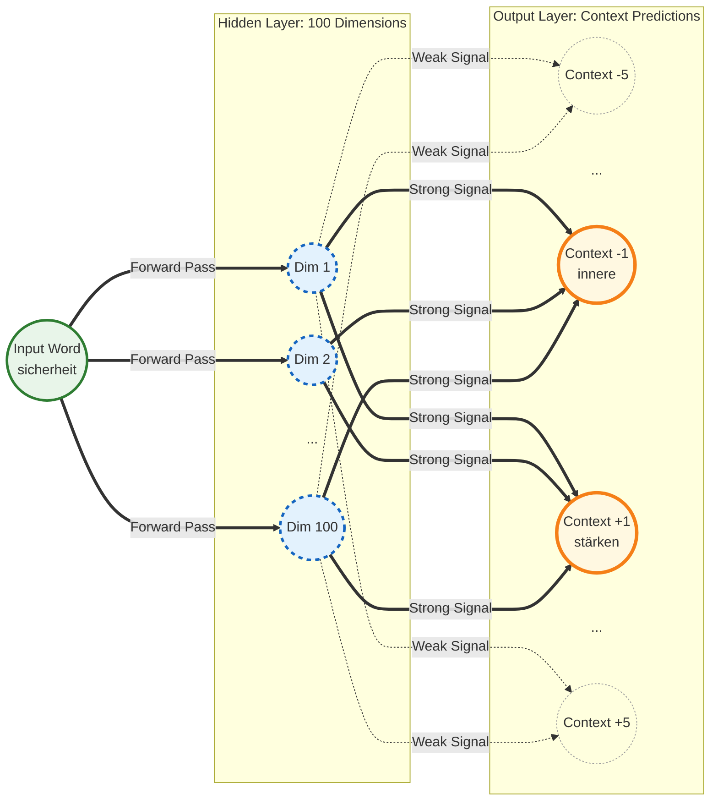

# Political Word Embeddings: Election Programs Bundestagswahl 2025

This repository implements a comparative NLP pipeline to analyze the semantic landscapes of the 2025 Bundestagswahl election programs (CDU, Grüne, SPD, AfD). This tool generates high-dimensional embeddings to quantify ideological divergence.

---

## Table of Contents
1. [Theoretical Framework](#theoretical-framework)
2. [Data Engineering Pipeline](#data-engineering-pipeline)
3. [Gensim Model Architecture](#gensim-model-architecture)
    * [The Objective Function](#the-objective-function)
    * [CBOW vs. Skip-gram](#cbow-vs-skip-gram)
    * [Optimization Techniques](#optimization-techniques)
    * [Dynamic Hyperparameter Tuning](#dynamic-hyperparameter-tuning)
4. [Linguistic Preprocessing](#linguistic-preprocessing)
5. [Distance Metrics & Semantic Quantization](#distance-metrics--semantic-quantization)
6. [Engineering Constraints & Small Corpus Variance](#engineering-constraints)
7. [Implementation & CLI Usage](#implementation--usage)

---

## Theoretical Framework
The project utilizes **Word2Vec**, a class of shallow, two-layer neural networks, to map discrete lexical tokens into a continuous vector space $\mathbb{R}^d$. The primary goal is to compute a transformation where the spatial proximity of vectors reflects the semantic affinity defined by the political corpora of specific parties.

## Data Engineering Pipeline
The pipeline is designed with modularity and reproducibility in mind:
* **Ingestion:** PDF parsing via `pdfplumber` with coordinate-based bounding box filtering to eliminate structural noise (headers/footers).
* **Normalization:** Tokenization and Lemmatization via `spaCy`'s `de_core_news_sm` (Transformer-based pipeline) to reduce inflectional variance.
* **Vectorization:** Localized training of four distinct Word2Vec models using `Gensim`.
* **Interface:** A CLI tool utilizing Centroid-based phrase matching for multi-token queries.

---

## Gensim Model Architecture

### The Objective Function
Gensim's implementation of Word2Vec optimizes the weights of a hidden "projection" layer. For a given sequence of training words $w_1, w_2, w_3, \dots, w_T$, the objective is to maximize the average log probability:

$$\frac{1}{T} \sum_{t=1}^{T} \sum_{-c \le j \le c, j \ne 0} \log p(w_{t+j} | w_t)$$

where $c$ is the training context window size. **The word vectors are essentially the learned weights of the hidden layer**, which act as a lookup table (Embedding Matrix) for the vocabulary.

### CBOW vs. Skip-gram
While the user may specify the architecture, the implementation nuances are critical:
* **CBOW (Continuous Bag of Words):** The model predicts the "center word" $w_t$ based on the sum/average of the surrounding context vectors. It is statistically faster and better for frequent words.
* **Skip-gram ($sg=1$):** Instead of predicting one center word, the model uses the center word to predict the surrounding context. 
* **Project Decision:** For the BW programs, **Skip-gram** is preferred. Skip-gram works better with small amounts of training data and represents rare political terms (e.g., "Zwangsfinanzierung" or "Netzstabilität") more accurately than CBOW.

#### Visualizing the Skip-Gram Architecture
Our model utilizes the Continuous Skip-Gram architecture. Rather than guessing a missing word, the network takes a target word and attempts to predict the semantic context surrounding it.



### Optimization Techniques
To handle the computational cost of the Softmax function over a large vocabulary, Gensim utilizes **Negative Sampling (NEG)**. Instead of updating all weights for every sample, the model only updates the weights for the target word and a small number of "negative" (noise) words, significantly improving training efficiency on local machines.

### Dynamic Hyperparameter Tuning
Because the length of federal election programs varies drastically between parties (e.g., condensed summary manifestos vs. extensive 100+ page *Langfassungen*), applying static hyperparameters across all models leads to inconsistent vector spaces. To solve this, the pipeline implements a **Dynamic Hyperparameter Heuristic** based on the total token count of each corpus:

* **Small Corpora (<15k tokens):** Require more passes (`epochs=12`) to sufficiently learn weights without underfitting, and a constrained dimensionality (`vector_size=60`) to prevent vector sparsity (the "Curse of Dimensionality").
* **Medium Corpora (15k–30k tokens):** Use balanced defaults (`epochs=7`, `vector_size=100`).
* **Large Corpora (>30k tokens):** (e.g., the program of *Die Grünen*). These are trained with fewer passes (`epochs=4`) to prevent overfitting (which causes embedding collapse and unnatural memorization of boilerplate text) and higher dimensions (`vector_size=120`) to capture richer semantic nuances. The `min_count` is also raised to filter out rare noise.

This dynamic scaling ensures that each party's vector space accurately reflects its specific semantic landscape. Furthermore, the pipeline includes a **Manual Override** dictionary, allowing data engineers to bypass the automated heuristic and force specific parameters for targeted ablation studies.

---

## Linguistic Preprocessing
In German NLP, simple tokenization is insufficient due to high morphological complexity and compound noun structures.
* **Lemmatization:** We map all word forms to their lemma (root) to ensure that "Steuern," "steuerlich," and "Steuerlast" contribute to the same vector coordinate.
* **Custom Stopword Filtering:** Standard NLP stopword lists are augmented with "Domain-Specific Noise" (e.g., *Deutschland*, *Regierungsprogramm*, *Wahlprogramm*). Removing these prevents the vector space from collapsing toward geographically or administratively dominant tokens.

---

## Distance Metrics & Semantic Quantization

### Cosine Distance
We quantify similarity using the **Cosine Similarity**, which measures the cosine of the angle between two vectors. This is preferred over Euclidean distance because we are interested in the *orientation* (contextual profile) rather than the *magnitude* (frequency) of the words.

$$\text{Cosine Distance} = 1 - \frac{\sum_{i=1}^{n} A_i B_i}{\sqrt{\sum_{i=1}^{n} A_i^2} \sqrt{\sum_{i=1}^{n} B_i^2}}$$

### Semantic Quantization Bins
To bridge the gap between raw data and political insight, we apply a quantization scale to the distance values:

| Metric (Dist) | Label | Technical Description |
| :--- | :--- | :--- |
| $\le 0.25$ | **Core Identity** | Near-identical contextual distribution; often denotes collocations. |
| $0.25 - 0.45$ | **Strong Association** | High probability of shared context within the same thematic cluster. |
| $0.45 - 0.65$ | **Thematic Context** | Broad semantic relation; words appear in the same policy area. |
| $0.65 - 0.80$ | **Weak/Incidental** | Sparse co-occurrence; likely noise in small samples. |
| $> 0.80$ | **Semantic Noise** | Orthogonal or unrelated vectors. |

---

## Engineering Constraints
### Small Corpus Variance
Data scientists should be aware that these models are trained on **Low-Resource Data**. Typical election programs contain 10k–50k tokens. 
1.  **High Variance:** Small changes in hyperparameters (`min_count`, `window`) can lead to significant shifts in the vector space.
2.  **No Pre-training:** These models are trained from scratch to capture *only* the specific party's bias, avoiding the "general language" bias of larger models like BERT or GPT.
3.  **Stability:** We use a controlled `vector_size` to prevent the "Curse of Dimensionality," where the vector space becomes too sparse for the small number of training samples.

---

## Implementation & CLI Usage

### Setup
```bash
pip install -r requirements.txt
python -m spacy download de_core_news_sm